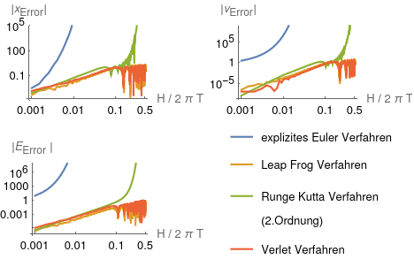
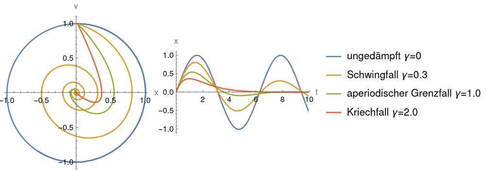
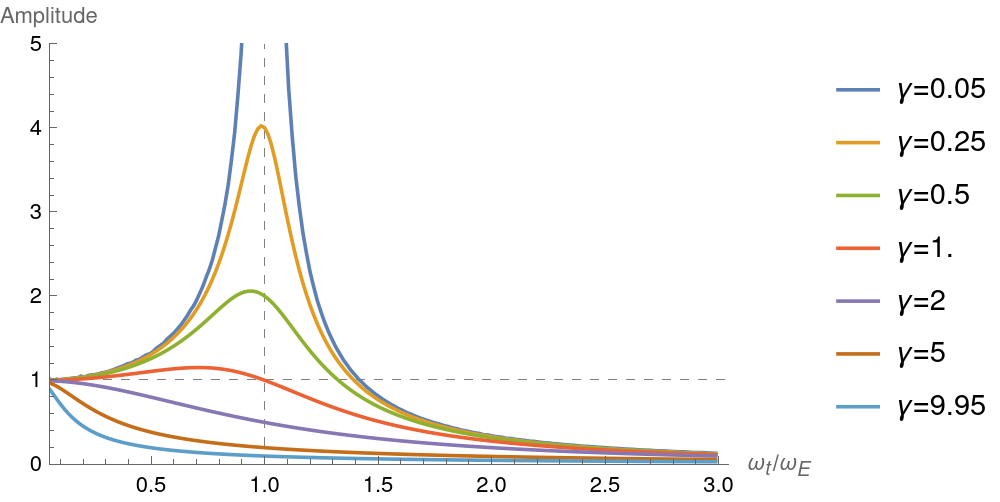
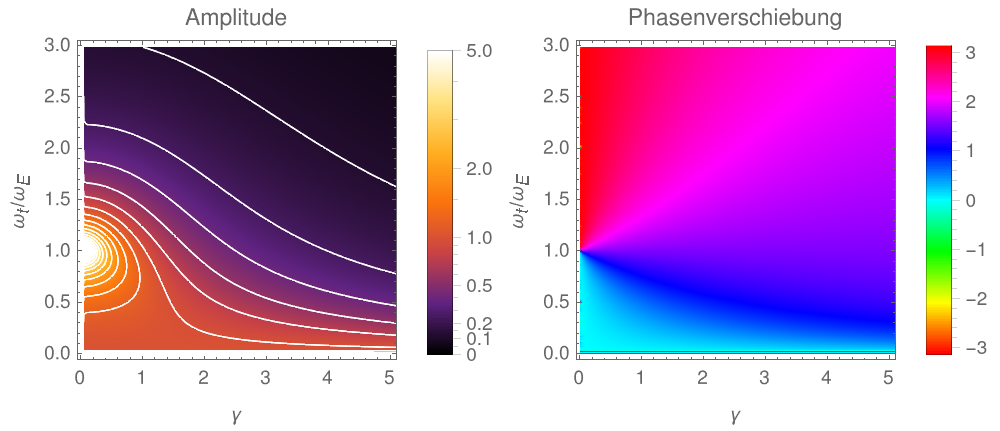
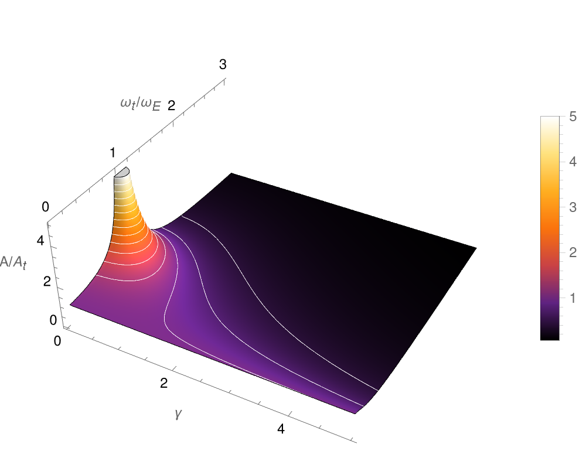

# Computerphysik I: Blatt 03

von *Aurel Müller-Schoenau* und *Leon Oleschko*

## a)
Um die Fehlerabhängigkeit von verschiedenen numerischen Methoden zu prüfen, wurde ein harmonischer Oszillator (Periodendauer $T$) für $500$ Oszillationen mit verschiedenen Zeitlichen Auflösungen $H$ simuliert. Dabei ist $H\in[0.001;0.001;0.5]/2\pi T$. 
Dies ist zwar unrealistisch hoch, lässt aber eine schnelle Simulation zu.

In der Abbildung unten sind der relative Auslenkungsfehler $x$, Geschwindigkeitsfehler $v$ und Energiefehler $E$ für verschiedene Zeitauflösungen $H$ dargestellt.

Dass die Energie nur beim Leap-Frog- und Verlet-Verfahren erhalten ist (zumindest beinahe) ist trotzdem gut zu erkennen.
Diese beiden liefern auch nahezu dieselben Ergebnisse, was nicht verwunderlich ist, da beide symmetrische Zweischrittverfahren sind. Die Energie ist erhalten, weil die Schwingung des harmonischen Oszillators unter Zeitumkehr invariant ist, somit ist die Symmetrie der Verfahren hinreichend für Energieerhaltung.

Für kleine Schrittweiten ist das Runge-Kutta-Verfahren beinahe genau so gut wie die symmetrischen Verfahren. Für komplexere Systeme sollte es sogar bessere Ergebnisse liefern aufgrund höherer Konsistenzordnung, jedoch haben die symmetrischen Verfahren in diesem Fall einen systematischen Vorteil.

Das explizite Euler-Cauchy-Verfahren schneidet als nicht symmetrisches Einschrittverfahren am schlechtesten ab. Der "Energiegewinn" ist dadurch zu erklären, dass das Verfahren prinzipbedingt in den Bereichen, in denen die exakte Lösung eine Krümmung besitzt quasi zu weit ausschwenkt, deshalb wird die Schwingungsamplitude immer größer und die Energie wächst immer weiter an.

## b)

Im Diagramm unten ist das Phasendiagramm für verschiedene Dämpfungen $\gamma$ dargestellt. Simuliert mit dem [Verlet Verfahren](C_Erzwungen.c).

## c), d), e)

**c)** In der oberen Abbildung ist für verschiedene Dämpfungen $\gamma$ die Resonanzkurve dargestellt. Dabei berechnet das [Programm](C_Erzwungen.c) für $\gamma\in [0;0.05;10)$ die Resonanzkurven, diese können dann selektiv dargestellt werden.

Die Amplitude wird bestimmt, indem das Maximum nach einer Einschwingzeit bestimmt wird.

**e)** Indem an diesem Zeitpunkt die Phase der antreibenden Schwingung gespeichert wird, kann auch die Phasenverschiebung zwischen der antreibenden und resultierenden Schwingung bestimmt werden.
Diese ist in $rad$ in dem unteren Diagram rechts dargestellt.
Dabei ist schön der Phasensprung von $Pi$ bei der Resonanzkatastrophe bei schwacher Dämpfung zu sehen.

**d)** unten ist der etwas unübersichtlicher der 3D Plot dargestellt:

